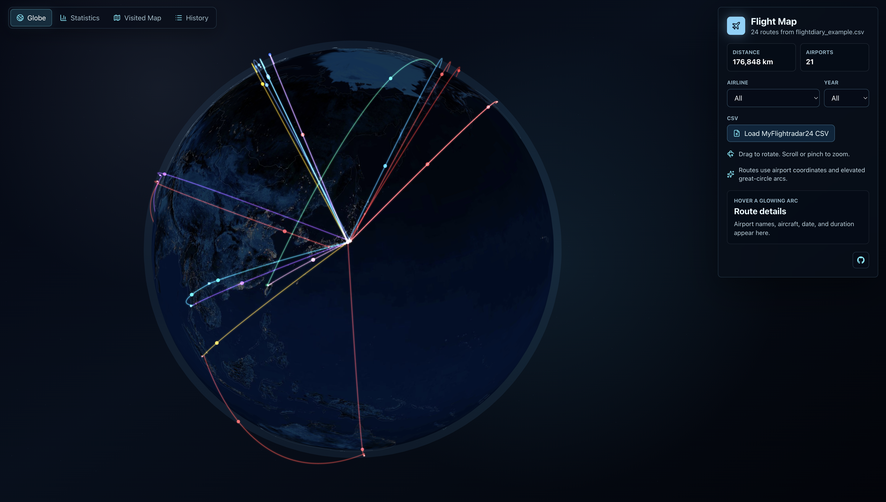

# Flight Map

An interactive 3D globe for browsing flight diary CSV exports. The app renders elevated great-circle routes over a dark Earth texture, with airline-colored arcs, moving flight markers, country outlines, and filters for airline and year.



## Demo site
https://flight-map.h1hun.com/

## Features

- Load a MyFlightradar24-style CSV from the browser.
- Use a fictional bundled example CSV by default.
- Rotate and zoom the globe with pointer controls.
- Resolve airport coordinates from a local seed cache, with server-side fallback to OurAirports data.
- Assign airline route colors from a local seed cache, with deterministic fallback colors.
- Run as a single Node container that serves both the static Vite app and the API.

## Development

Install dependencies:

```bash
corepack enable
pnpm install
```

Run the API and Vite dev server in separate terminals:

```bash
pnpm run dev:api
pnpm run dev
```

Build everything:

```bash
pnpm run build
```

Run the production server locally:

```bash
pnpm start
```

The production server listens on `PORT` and defaults to `8080`.

## CSV Data

The bundled `public/flightdiary_example.csv` is fictional sample data. Personal flight diary exports should be loaded through the browser and should not be committed to `public/`, because files in `public/` are served directly.

## Container

Build the image:

```bash
docker build -t flight-map .
```

Run it locally:

```bash
docker run --rm -p 8080:8080 flight-map
```
